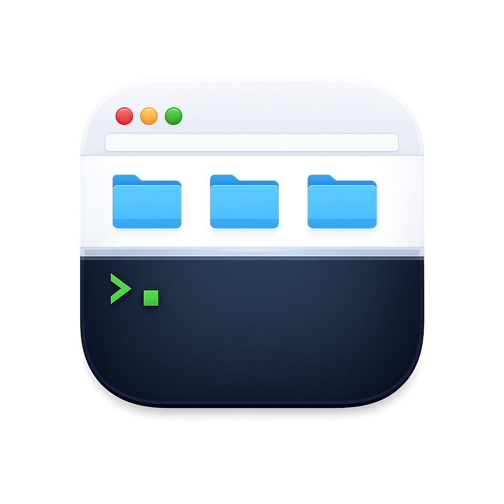

<p align="center">
  
</p>

# FinderTerm

Finderウィンドウの下部に吸着するターミナルペイン。Finderで見ているフォルダにシェルが自動で追従するので、どのフォルダでも「開いてすぐ `claude`」ができる。

```
┌────────────────────────────┐
│ Finder: ~/projects/myapp   │
│ 📁 src   📁 docs   📄 ...   │
├────────────────────────────┤ ← 境界バーをドラッグで高さ調整
│ ~/projects/myapp ❯ claude  │
│ ...                        │
└────────────────────────────┘
```

## 特徴

- **Finderウィンドウごとに独立したターミナル** — ウィンドウにもタブにも、それぞれ専用のシェルセッションが付く
- **フォルダ移動に自動追従** — Finderでフォルダを移動すると、シェルが**アイドルのときだけ** `cd` される。claude・vim・ビルド等の実行中は絶対に邪魔しない(ptyのフォアグラウンドプロセスグループで判定)
- **実行終了後の再同期** — 長時間コマンドが終わってプロンプトに戻ると、Finderの現在フォルダに一度だけ再同期
- **セッション保護** — 実行中プロセスがあるウィンドウを閉じると確認ダイアログ。「セッションを残す」で独立ウィンドウ化して継続できる
- **⌥⌘T** で全ペインの表示/非表示を一括トグル(メニューバーアイコンからも可)
- SIP無効化・コード注入なし。必要なのはアクセシビリティとオートメーションの2権限のみ

## 動作環境

- macOS 13 (Ventura) 以降
- ビルドに Swift 5.9+(Xcode Command Line Tools)

## インストール

### 方法1: ビルド済みアプリをダウンロード

[Releases](https://github.com/neuroiwm/in-finder-terminal/releases) から `FinderTerm.zip` をダウンロードして展開し、`FinderTerm.app` をアプリケーションフォルダに移動する。**Apple Silicon (arm64) 専用**。

> **⚠️ 初回起動時にGatekeeperにブロックされます。** このアプリは公証(notarization)なしのad-hoc署名のため、ダウンロード直後は「開発元を確認できないため開けません」と表示される。macOS Sonoma以降は右クリック→開くでも回避できず、次のどちらかの操作が必要:
>
> 1. 一度ダブルクリックしてブロックさせた後、**システム設定 > プライバシーとセキュリティ** を下にスクロールし「このまま開く」をクリック
> 2. またはターミナルでquarantine属性を外す:
>    ```bash
>    xattr -dr com.apple.quarantine /Applications/FinderTerm.app
>    ```
>
> また、ad-hoc署名の性質上、**新しいバージョンに差し替えるたびにアクセシビリティ権限の再付与が必要**(システム設定でオフ→オン)。この手間を避けたい場合はソースからのビルド(自己署名証明書での署名)を推奨。

### 方法2: ソースからビルド

```bash
./scripts/build-app.sh
open build/FinderTerm.app
```

Swift 5.9+(Xcode Command Line Tools)が必要。

## 初回起動

初回起動時に2つの権限を求められる:

1. **アクセシビリティ**(Finderウィンドウの追跡) — システム設定 > プライバシーとセキュリティ > アクセシビリティ
2. **オートメーション**(Finderへのフォルダパス問い合わせ) — 最初のウィンドウ検出時にプロンプト

許可するとメニューバーのターミナルアイコンの⚠️が消え、開いているFinderウィンドウにペインが付く。

### 開発時の署名について

`scripts/build-app.sh` はキーチェーンに自己署名証明書 **FinderTerm Dev Signing** があればそれで署名する(推奨: 再ビルドしてもTCC権限が維持される)。無ければad-hoc署名になり、**再ビルドのたびにアクセシビリティ権限の再付与が必要**(システム設定でオフ→オン)。

## 使い方

| 操作 | 挙動 |
|------|------|
| Finderウィンドウ/タブを開く | 下部にターミナルが現れ、そのフォルダでシェルが起動 |
| フォルダを移動 | アイドルなら自動 `cd`(入力途中の行はCtrl-Uでクリアされる仕様) |
| 「最近の項目」等パスのない画面 | cdせず直前のフォルダに留まる |
| ペイン上端の境界バーをドラッグ | 高さ比率を変更(全ペイン共通・永続化) |
| 実行中のウィンドウを閉じる | 確認ダイアログ →「セッションを残す」で独立ウィンドウ化 |
| ⌥⌘T / メニューバー | 全ペインの表示/非表示 |
| メニューバー > ログイン時に起動 | SMAppServiceで自動起動を登録 |

## 設定・診断

```bash
# 診断ログの有効化/無効化(出力先: ~/Library/Logs/FinderTerm.log)
defaults write com.iwama.finderterm debugLogging -bool true   # or false

# ペイン高さ比率(通常は境界バーのドラッグで変更)
defaults read com.iwama.finderterm paneHeightRatio
```

## 開発

```bash
swift test          # ユニット+統合テスト(実ptyでのアイドル判定・cd注入を含む)
```

- 仕様: [`spec.md`](spec.md)(実測に基づく設計判断のログを含む)
- 手動テストチェックリスト: [`TESTING.md`](TESTING.md)

### 実装メモ(ハマりどころ)

実装で判明したmacOSの実挙動。詳細はspec.mdとソースコメント参照:

- **Finderにビューは注入できない** — ペインは枠なし・非アクティブ化NSPanelをAXイベント駆動で追従させる「吸着」方式
- **`posix_spawn`+`POSIX_SPAWN_SETSID`では制御端末を獲得できない** — ジョブ制御(=アイドル判定)が壊れるため`forkpty()`を使用
- **Finderのタブ切り替えとウィンドウのクリック前面化はAXイベントを発火しない** — オンスクリーンウィンドウ集合とz順序を0.5秒ポーリングで監視して自己修復
- **LSUIElementアプリには⌘V/⌘Cの配送経路がない** — 非表示の編集メニューをインストールして解決
- **TCCはad-hoc署名の再ビルドを別アプリと見なす** — 自己署名証明書で署名を安定化
- AXウィンドウ→CGWindowID変換に私用API `_AXUIElementGetWindow` を使用(FinderのAppleScript `window id` と同一値)

## 制限事項(v1)

- フルスクリーンのFinderには追従しない(ペイン非表示)
- ホットキー(⌥⌘T)とフォントは固定
- アクセシビリティ権限が必要なためサンドボックス化不可 = App Store配布不可
- 自動cd時に入力途中のコマンドラインはクリアされる(追従の確実性を優先)
